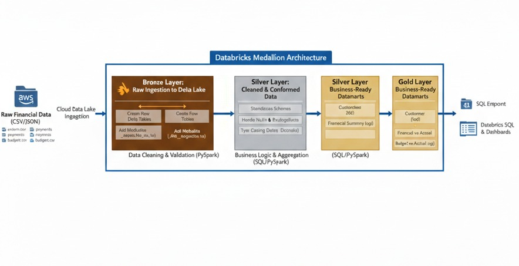
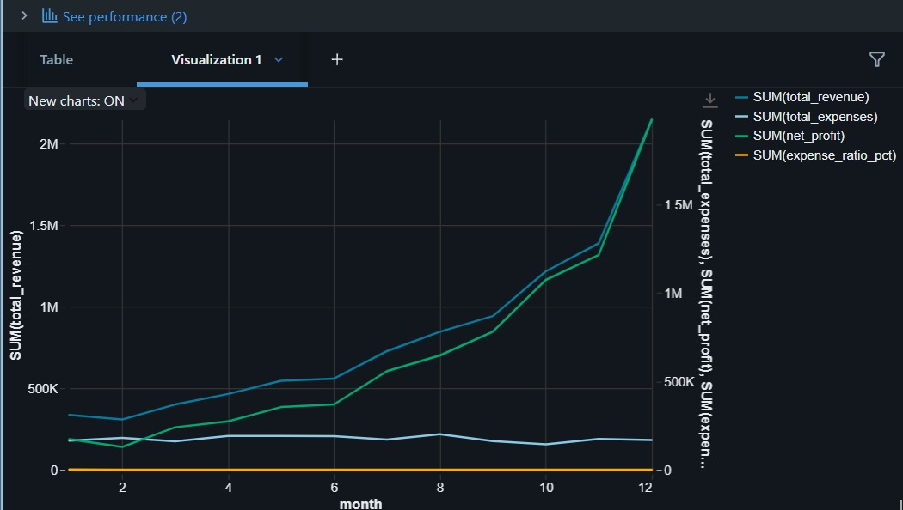

# End-to-End-Financial-Data-Engineering-Pipeline
## Inroduction
### This project demonstrates the design and implementation of a production-grade financial data engineering pipeline using modern big data technologies and best practices.

The pipeline ingests raw financial datasets from Amazon S3, processes them through a Medallion Architecture (Bronze → Silver → Gold) using Apache Spark on Databricks, and delivers business-ready financial analytics optimized for SQL querying and executive reporting.

The solution is designed to reflect real-world enterprise data engineering workflows, focusing on data quality, scalability, auditability, and financial accuracy.

## Architecture Overiview

This project demonstrates a production-grade data pipeline using Databricks and PySpark, following the Medallion Architecture to process raw financial data from AWS S3.

## Technology Stack

Apache Spark (PySpark)

Databricks

Amazon S3

Delta Lake & Parquet

SQL

Python
### Key Features
### Medallion Architecture
Bronze Layer: Raw data ingestion from S3 with ingestion metadata for traceability

Silver Layer: Data cleansing, validation, schema standardization, and business rules

Gold Layer: Aggregated financial KPIs and analytics-ready data marts
### Finance-Focused Analytics
Revenue, expenses, profit, and budget vs actual analysis

Customer-level financial insights (Customer 360)

Daily and monthly financial KPIs

Payment success and outstanding balance tracking
### Scalable Big Data Processing
Apache Spark for distributed data processing

Parquet and Delta Lake formats for optimized storage and performance

### SQL-Driven Business Insights
Executive-level SQL analytics

Month-over-Month growth analysis

Budget variance and overspending detection
### Production-Oriented Design

Clear separation of ingestion, transformation, and analytics layers

Reusable transformation functions

Audit-friendly metadata and lineage tracking

## Analytics Dashboard

The final gold layer tables were used to build a comprehensive Business Intelligence dashboard in Databricks.

Revenue vs Expenses

[GitHub Pages](https://pages.github.com/).
